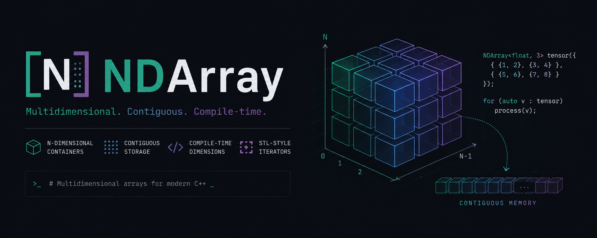

<p align="center">
  <b>English</b> | <a href="./README.ru.md">Русский</a>
</p>

<p align="center">
  
</p>

<p align="center">

[](https://en.cppreference.com/w/cpp/20)
[](https://opensource.org/license/mit)

[](https://github.com/JohnyDeve/NDArray/actions/workflows/ci.yml)
[](https://clang.llvm.org/docs/ClangFormat.html)
[](https://github.com/google/googletest)


</p>

# NDArray

Modern C++ header-only multidimensional contiguous container library focused on deterministic memory behavior, STL-oriented semantics, and low-level object lifetime control.

NDArray provides:

* compile-time dimensionality
* contiguous storage guarantees
* multidimensional traversal abstractions
* iterator/view-based access
* constrained template APIs
* explicit ownership semantics

> [!NOTE]
> NDArray is designed as a systems-oriented container implementation prioritizing predictable memory layout and explicit control over object lifetime.

---

## Features

| Feature                   | Description                                              |
| ------------------------- | -------------------------------------------------------- |
| Contiguous Storage        | All elements are stored inside a contiguous memory block |
| Header-Only               | No separate compilation required                         |
| STL-Oriented Design       | Familiar container semantics and iterator behavior       |
| Recursive Initialization  | Natural multidimensional initialization syntax           |
| Views & Iterators         | Dedicated multidimensional traversal abstractions        |
| Concepts & SFINAE         | Compile-time constrained APIs                            |
| Explicit Lifetime Control | Manual object construction/destruction model             |
| Unit Tests                | GoogleTest-based validation                              |
| CI Pipeline               | GitHub Actions build/test verification                   |

## Quick Example

```cpp
#include <NDArray.hpp>

NDArray<int, 2> matrix {
    {1, 2, 3},
    {4, 5, 6}
};

for (const auto& row : matrix) {
    for (const auto& value : row) {
        std::cout << value << ' ';
    }
}
```

## Views & Iteration

```cpp
NDArray<int, 2> matrix {
    {1, 2, 3},
    {4, 5, 6}
};

NDArrayView<int, 1> first_row = matrix[0];

for (auto& value : first_row) {
    std::cout << value << ' ';
}
```

> [!TIP]
> `NDArrayView` provides lightweight multidimensional traversal without transferring ownership.

## Build

### Configure

```bash
cmake -B build
```

### Build

```bash
cmake --build build
```

### Run Tests

```bash
ctest --test-dir build --output-on-failure
```

---

## Documentation

| Document                                           | Description                             |
| -------------------------------------------------- | --------------------------------------- |
| [Getting Started](./docs/getting-started.md)       | Basic setup and usage                   |
| [Views & Iteration](./docs/views-and-iteration.md) | Iterator and traversal system           |
| [Initialization](./docs/initialization.md)         | Recursive multidimensional construction |
| [Memory Management](./docs/memory-management.md)   | Allocation and lifetime model           |
| [API Reference](./docs/api-reference.md)           | Public API overview                     |
| [Testing & CI](./docs/testing-and-ci.md)           | Tests and GitHub Actions                |

## Testing

The project includes:

* GoogleTest unit tests
* GitHub Actions CI
* clang-format verification

> [!NOTE]
> All tests are executed automatically on every push and pull request.

## License
This project is licensed under the **MIT License**. See the [LICENSE](./LICENSE) file for more details. 

---

## Contacts & Support

### Author

**Kuzyakin Ivan** — C Developer & System Architect  
Feel free to reach out for collaboration or questions regarding the implementation.

[](https://github.com/JohnyDeve)
[](www.linkedin.com/in/ivan-kuzyakin-1010011100000001010000110000101011011)
[](https://t.me/kuzak1n)

### Support the Project
If this tool helped you or saved you some time, you can support its further development:

[](https://www.donationalerts.com/r/kuzakinc)

---
*Made with precision, care and love by JohnyDeve|Kuzak*
